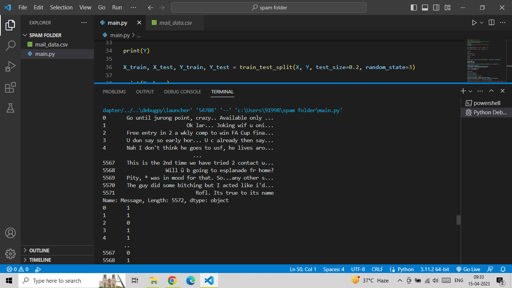
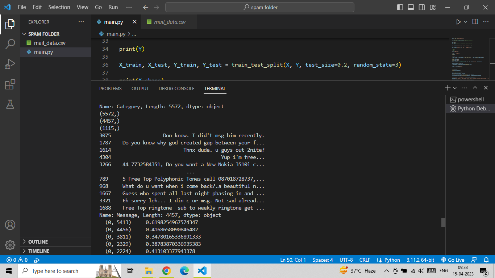
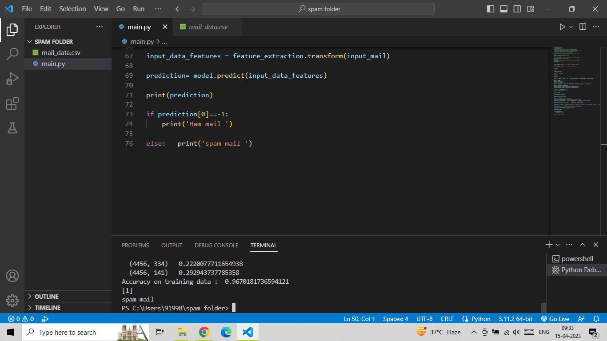

# Spam-mail-Prediction-using-LogisticRegression
the Spam-mail-Prediction-using-LogisticRegression project! Our goal is to create a machine learning model that can predict whether an email is spam or not based on its contents.

Spam emails can be a significant problem for individuals and businesses alike, and our project aims to provide an effective solution to this issue. We have utilized the power of logistic regression, a popular classification algorithm in machine learning, to build a predictive model for spam email detection.

We have preprocessed the data using techniques such as tokenization, stopword removal, and stemming, to convert the text into a more manageable format. We then trained our logistic regression model using Scikit-learn, a popular Python library for machine learning. We evaluated the model's performance using various metrics like accuracy, precision, recall, and F1-score to ensure that it is reliable and effective.

# Table of Contents
## Screenshot
## Installation
## Contributing

# Screenshot
there is the some screensot 

# Installation 
You can install this project directiory using this command
1. Clone the repository - git clone https://github.com/umairrrkhan/Spam-mail-Prediction-using-LogisticRegression.git

# Contributing
Contributions to this project are always welcome! Here are a few ways you can help:
1. Report any bugs or issues you encounter while using the project.
2. Suggest new features or improvements.
3. Submit a pull request with bug fixes, improvements, or new features.
